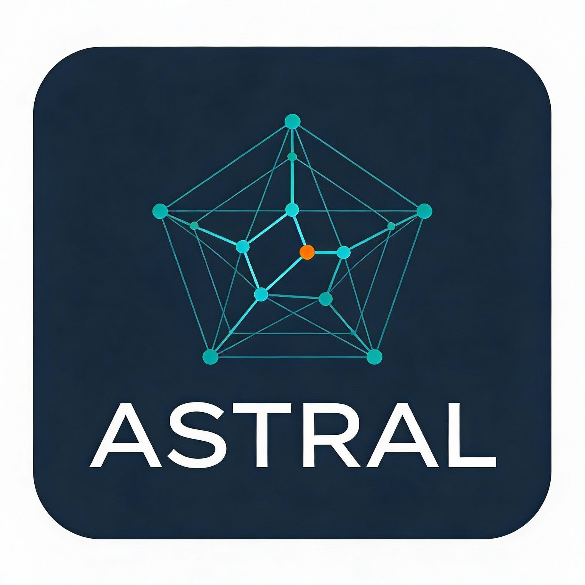

# Prototype Tool for demonstrating the ASTRAL (Architecture-Centric Security Threat Risk Assessment using LLMs) approach.

This interactive web application demonstrates the ASTRAL (Architecture-Centric Security Threat Risk Assessment using LLMs) approach, using multimodal LLMs to support architecture-centric threat risk assessments by generating architectural narrations, threat models, attack trees, and probabilistic risk analysis based on uploaded architecture diagrams.

---

## Overview

The application provides an interactive platform for security assessment of cyber-physical systems using LLM-powered analysis. Users can upload system architecture diagrams (images), clarify LLM responses (text) and receive comprehensive security assessments including:

- **Architectural Narration**: Automated extraction and understanding of system components and data flows
- **Threat Modelling**: STRIDE-LM methodology-based threat identification and analysis (Spoofing, Tampering, Repudiation, Impersonation, Denial-of-Service, Elevation of Privileges, Lateral Movement)
- **Attack Tree Generation**: Hierarchical visualisation of potential attack vectors using Mermaid diagrams
- **Bayesian Network Analysis**: Probabilistic modelling of security risks and countermeasures
- **AutomationML Export**: Generation of AutomationML (.aml) files for system representation and analysis

---

## Features

### STRIDE-LM Threat Modelling

The application implements an enhanced STRIDE methodology tailored for cyber-physical systems:
- Automated identification of assets, trust boundaries, and data flows
- LLM-powered threat generation based on system context
- Structured JSON output for integration with security tools

### Mermaid Attack Trees

Hierarchical attack trees visualize:
- Attack goals and sub-goals
- Attack vectors and prerequisites
- AND/OR relationships between attack steps
- Interactive diagrams for security training and documentation

### Bayesian Network Analysis and Countermeasure Simulation

Probabilistic modelling capabilities:
- Causal relationships between threats and vulnerabilities
- Countermeasure effectiveness simulation
- Risk propagation analysis

### Multi-LLM Support

Flexible integration with multiple LLM providers:
- Mistral AI
- Google Gemini
- OpenAI
- Anthropic Claude
- OpenRouter
- Easy switching between providers based on availability and cost

---

## Installation

### Prerequisites

- Python 3.8 or higher
- pip package manager
- API keys for at least one LLM provider

### Setup Instructions

1. **Clone the repository**:
   ```bash
   git clone https://github.com/shaofeihuang/ASTRAL.git
   cd ASTRAL
   ```

2. **Install dependencies**:
   ```bash
   pip install -r requirements.txt
   ```

3. **Configure API keys**:
   - Add your API keys to Azure Key Vault (default)
   - Otherwise, add your API keys to a `.env` file for local testing:
   ```bash
   # .env file
   MISTRAL_API_KEY=your_mistral_api_key_here
   GEMINI_API_KEY=your_gemini_api_key_here
   ANTHROPIC_API_KEY=your_anthropic_api_key_here
   OPENAI_API_KEY=your_openai_api_key_here
   ```

4. **Run the application**:
   ```bash
   streamlit run main.py
   ```

5. **Access the application**:
   - Open your browser and navigate to `http://localhost:8501`

---

## Requirements

Key dependencies include:

- **Streamlit** (1.28.0): Web application framework
- **LLM Providers**: OpenAI, Anthropic, Mistral, Gemini
- **LangChain** (0.1.0): LLM orchestration framework
- **Bayesian Analysis**: pgmpy, pyro-ppl, torch
- **Security**: azure-keyvault-secrets, azure-identity

See `requirements.txt` for the complete list of dependencies.

---

## Usage Guide

### Step 1: Configure Settings
1. Launch the application using `streamlit run main.py`
2. Select LLM provider and model from pull-down menu
3. Enter your own API key if needed
4. Select CPS system context from pull-down menu. Click the input field and enter your own custom context if needed.

### Step 2: Upload Architecture Diagram
1. Navigate to the upload section in the UI
2. Upload your system architecture diagram or data flow diagram (supports common image formats: PNG, JPG, JPEG)

### Step 3: Generate Architectural Explanation
1. Click the "Generate Architectural Explanation" button
2. The LLM will analse the diagram and provide a detailed textual explanation of the system components, data flows, and interactions
3. Review the explanation, optionally add further prompts to the LLM, and download in markdown format if needed

### Step 4: Create Threat Model
1. Navigate to the "Threat Model" tab
2. Click "Generate STRIDE-LM Threat Model"
3. The system uses STRIDE-LM methodology to identify potential threats:
   - **S**poofing
   - **T**ampering
   - **R**epudiation
   - **I**nformation Disclosure
   - **D**enial of Service
   - **E**levation of Privilege
   - **L**ateral **M**ovement
4. Review and download the threat model in JSON format if needed.

### Step 5: Generate Attack Tree and Paths
1. Move to the "Attack Model" tab
2. Click "Generate Attack Model"
3. The system generates attack paths, attack tree code that is compatible with Mermaid, and an attack tree diagram preview
4. Download the attack tree code for visualisation in Mermaid Live, and download the raw attack tree data in JSON format if needed.

### Step 6: Generate System Model
1. Navigate to the "System Model" tab
2. Click "Generate System Model"
3. The system creates an AutomationML representation of the system. This process may take several minutes depending on the complexity of the system architecture and threat model
4. Check the generated AutomationML file and update the exposure probabilities with real-world data
5. Download the .aml file if needed

### Step 7: Bayesian Network Analysis
1. Navigate to the "Bayesian Analysis" tab
2. Optionally change the system installation date if needed
3. Click "Load Model Attributes". Probabilistic model of exposure (successful attack), severe impact, and risk score is computed automatically
4. Edit model attribute values, change "Attacker ID" and "Attack Feasibility (AF) Modifier" values, if needed

### Step 8: Countermeasure Simulation
1. Navigate to the "Countermeasures" tab
2. Change mitigation likelihood values for each vulnerability (i.e. probability that countermeasure(s) will mitigate the vulnerability) to find the most effective combination for reducing risk

### Step 9: Multi-Objective Optimisation
1. Navigate to the "Optimisation" tab
2. Execute optimisation runs to identify and analyse Pareto-optimal mitigation configurations

---

## Project Structure

```
ASTRAL/
│
├── .gitignore                           # Git ignore rules
├── LICENSE                              # MIT license
├── logo.jpeg                            # Project logo
├── main.py                              # Main Streamlit application entry point
├── bayesian.py                          # Bayesian network analysis and probabilistic modelling
├── llm_functions.py                     # LLM-powered analysis and helper functions
├── prompts.py                           # Prompt templates for threat, architecture, and attack-tree analysis
├── utils.py                             # Shared utility helpers (parsing, caching, formatting, etc.)
├── requirements.txt                     # Python package dependencies
├── .env                                 # Local API key / config overrides (not committed)
├── README.md                            # Project overview and usage guide
│
├── docs/                                # Project documentation and walkthrough materials
│   ├── ASTRAL Example Pipeline.pdf      # End-to-end example pipeline documentation
│   ├── ASTRAL Supplementary Material.pdf # Supplementary documentation
│   └── Tool Walkthrough Video.mp4       # End-to-end tool walkthrough video
│
├── examples/                            # Example artifacts
│   ├── Architecture Diagrams/           # Sample CPS architecture diagrams
│   ├── Attack Models/                   # Example attack models generated by the system
│   └── AutomationML Files/              # Sample AutomationML system models
│
└── tabs/                                # Function definitions for each tab
    ├── tab_architecture.py              # Architecture ingestion and narration
    ├── tab_attack_model.py              # Attack model generation
    ├── tab_bayesian_analysis.py         # Bayesian analysis over attack graphs
    ├── tab_countermeasures.py           # Countermeasure portfolio configuration
    ├── tab_optimisation.py              # Multi-objective optimisation
    ├── tab_settings.py                  # Settings
    ├── tab_system_model.py              # System model generation (AutomationML)
    └── tab_threat_model.py              # Threat modelling
```

## License

This project is provided as-is for research and educational purposes. Please refer to the repository for license information.

---

## Support and Contact

For questions, issues, or suggestions:
- Open an issue on GitHub
- Review the code comments for implementation details
